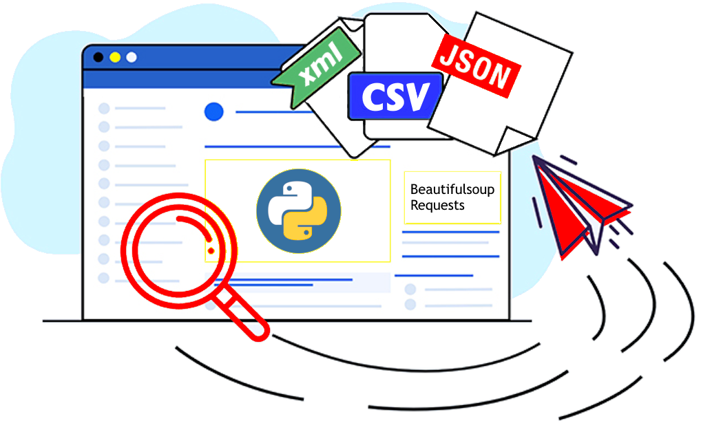
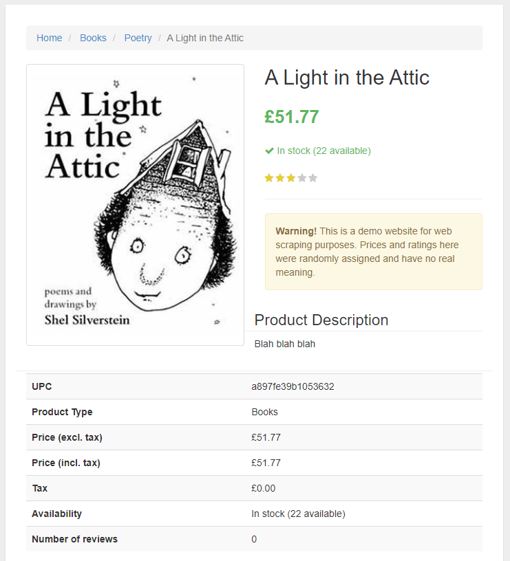

# BooKs ScRaPeR
[](https://www.python.org/)
[](https://www.crummy.com/software/BeautifulSoup/)
[](https://docs.python-requests.org/)


<p align="center">
  
</p>

## Contenidos

- [¿Qué es Books Scraper?](#about)
- [Echa un vistazo](#getting_started)
- [Uso](#usage)
- [Referencias](#refs)

## ¿Qué es Books Scraper? <a name = "about"></a>

Prueba de postulación a Tech-K, el proyecto consiste en hacer _scraping_ al sitio [books.ToScrape.com](https://books.toscrape.com/), obtener la información de mil libros y entregar un archivo CSV con los datos recopilados.

## Archivo original

El archivo de instrucciones original puede encontrarse [haciendo click aquí](./INSTRUCTIONS.md)

## Echa un vistazo <a name = "getting_started"></a>

Lo que hace el script es pedir la página y analizar el catálogo, recorriendo hoja a hoja, libro a libro.

[]()

Hay que tener en cuenta que el catálogo tiene enlaces que llevan a una página especial para cada detalle del libro seleccionado.

[]()

El script __main.py__ iniciará el proceso de recolección de datos, esto generará un archivo __CSV__,\
si lo deseas puedes ver el ejemplar obtenido con los datos recopilados: [thousend_scraped_books.csv](https://github.com/Marfullsen/webscraper-challenge/blob/master/docs/csv/thousend_scraped_books.csv)

[]()

Para ejecutar el script solo necesitas seguir los pasos que se explican a continuación:

### Requisitos Previos

- Python3
- Dependencias externas para Python3

El archivo de requisitos puede ser usado con el comando `python -m pip install -r requirements.txt`

Detalladamente, las bibliotecas a instalar son:

```
pip install requests
pip install beautifulsoup4
pip install lxml
pip install pytest
```

## Uso <a name = "usage"></a>

Al tener una conexión a internet y corroborar que el sitio se encuentre estable, bastará con ejecutar el archivo `main.py`

Cada página cuenta con 20 libros, revisar cada uno de esos libros demora alrededor de un segundo **por libro**.

```
Página 1                    
Página 2                    
Página 3                    

...                  

Página 50                   
Se procesarion 1000 libros. 
```

**Nota:** Una vez iniciado el proceso se irá rellenando el archivo CSV, en caso de problemas con la ejecución, el archivo quedará con la cantidad de datos que haya logrado procesar en aquel momento.

### Pruebas unitarias

Las pruebas unitarias se pueden realizar con el comando `pytest -xv tests.py`

Las pruebas a realizarse son:
- test_exists, comprueba que el archivo principal exista.
- test_create_csv_file, corrobora que se haya creado un archivo CSV **en blanco** (sólo con las cabeceras).
- test_write_to_csv, corrobora que se escriban __datos challa__.
- test_get_page_1_returns_200, verifica que un sitio existente devuelva el código http que indique que todo salió bien.
- test_get_page_bookname_returns_200, verifica que al entrar al enlance del libro del catálogo, este existe.
- test_get_page_0_returns_404, verifica que la página no existe o no se encuentra disponible.

## Referencias <a name = "refs"></a>

- Documentación de BS - [https://www.crummy.com/software/BeautifulSoup/bs4/doc/](https://www.crummy.com/software/BeautifulSoup/bs4/doc/)
- Documentación de CSV - [https://docs.python.org/3/library/csv.html](https://docs.python.org/3/library/csv.html)
- Primer libro del siito - [https://books.toscrape.com/catalogue/a-light-in-the-attic_1000/index.html](https://books.toscrape.com/catalogue/a-light-in-the-attic_1000/index.html)
- Reading and Writing CSV Files in Python - [https://realpython.com/python-csv/](https://realpython.com/python-csv/)
- Python docs, CSV Library - [https://docs.python.org/3/library/csv.html](https://docs.python.org/3/library/csv.html)
- Enumerate Python [https://www.geeksforgeeks.org/enumerate-in-python/](https://www.geeksforgeeks.org/enumerate-in-python/)
- Fatal bad revision GIT - [stackoverflow.com/what-does-fatal-bad-revision-mean](https://stackoverflow.com/questions/14550802/what-does-fatal-bad-revision-mean)
- Snippet encoding - [https://www.codegrepper.com/code-examples/python/csv+writerow+without+newline](https://www.codegrepper.com/code-examples/python/csv+writerow+without+newline)
- Decoding - [stackoverflow.com/how-to-decode-scrambled-character-encoding-special-character-encoding](https://stackoverflow.com/questions/8706107/how-to-decode-scrambled-character-encoding-special-character-encoding)
- Pounds Charcode problem - [https://stackoverflow.com/questions/55737316/python-selenium-text-returns-%C3%A2%E2%82%AC-instead-of-apostrophe](https://stackoverflow.com/questions/55737316/python-selenium-text-returns-%C3%A2%E2%82%AC-instead-of-apostrophe)
- Encoding - [https://stackoverflow.com/questions/27092833/unicodeencodeerror-charmap-codec-cant-encode-characters](https://stackoverflow.com/questions/27092833/unicodeencodeerror-charmap-codec-cant-encode-characters)